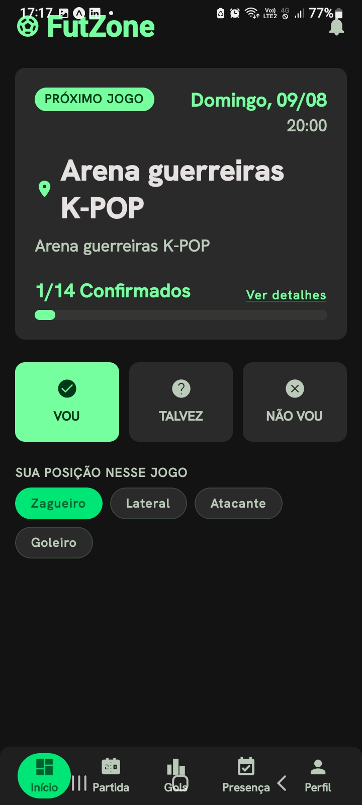
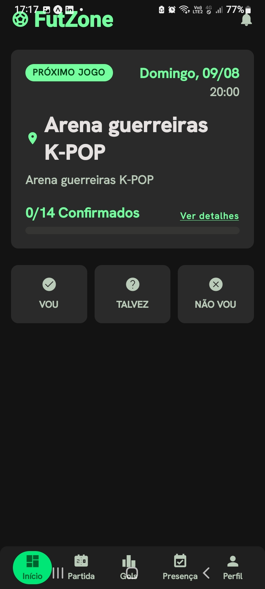
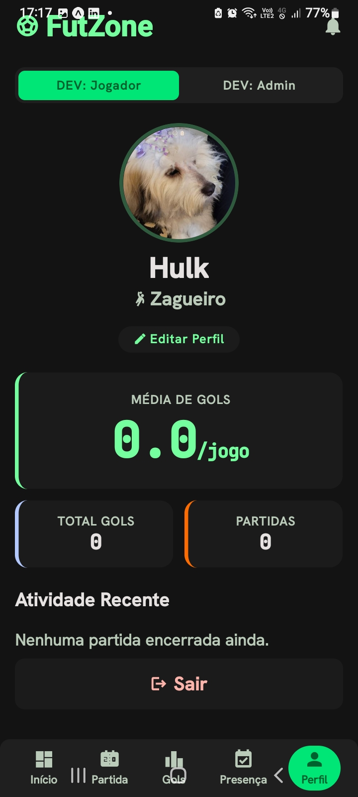

# FutZone Beta ⚽

App mobile (Android/iOS, React Native + Expo) para grupos que jogam futebol amador toda semana organizarem presença, escalação e artilharia — sem precisar de planilha ou grupo de WhatsApp bagunçado.

Projeto pessoal, em desenvolvimento ativo. Esta é uma **build beta offline**: todos os dados ficam salvos localmente no aparelho (sem servidor, sem internet necessária), pensada pra amigos testarem o app e darem feedback sobre usabilidade e fluxo antes da próxima fase (sincronização em nuvem com Supabase).

## Screenshots

<p align="center">
  
  
  
</p>

## Funcionalidades

- **Próximo jogo em destaque** na tela inicial, com confirmação de presença em um toque (Vou / Talvez / Não vou)
- **Escolha de posição** por partida (Zagueiro, Lateral, Atacante, Goleiro...)
- **Perfil do jogador** com foto, posição, média de gols, total de gols e partidas jogadas
- **Artilharia** e histórico de gols por partida, com detalhes de finalização e assistência
- **Escalação/elenco** do grupo, com controle de quem é admin
- **Placar ao vivo** para o "juiz" da partida lançar gols em tempo real
- **Convite por código** para novos jogadores entrarem no grupo
- Tema escuro, ícones e tipografia customizados a partir de um protótipo Figma/Stitch

## Stack técnica

- [Expo](https://expo.dev) (SDK 54) + [React Native](https://reactnative.dev) 0.81
- [Expo Router](https://docs.expo.dev/router/introduction/) — roteamento baseado em arquivos
- [Zustand](https://github.com/pmndrs/zustand) — state management, com persistência local via `AsyncStorage`
- [NativeWind](https://www.nativewind.dev/) (Tailwind CSS v3) — estilização
- [TypeScript](https://www.typescriptlang.org/)
- [Supabase](https://supabase.com) — schema Postgres + RLS já modelado (`supabase/schema.sql`), pronto para a próxima fase com backend real

## Arquitetura

Nesta build, todo o estado (jogadores, grupo, partidas, presença, gols) vive num único store Zustand persistido localmente no dispositivo — não há backend conectado. Isso foi uma escolha deliberada para viabilizar um teste beta simples, sem depender de contas, confirmação de e-mail ou conexão com a internet.

O código já tem uma modelagem de dados pensada para mapear 1:1 com um schema Postgres (`supabase/schema.sql`, com tabelas, RLS policies e realtime configurados) e um cliente Supabase pronto (`src/lib/supabase.ts`) — a próxima fase do projeto é reconectar o store a esse backend para sincronização entre jogadores em tempo real.

## Rodando localmente

```bash
npm install
npx expo start --tunnel
```

Escaneie o QR code com o app **Expo Go** (Android/iOS) para testar no celular.

```bash
npx tsc --noEmit        # checagem de tipos
npx expo export -p android   # smoke test de bundling
```

## Roadmap

- [ ] Reconectar ao Supabase (auth, sincronização em tempo real entre jogadores)
- [ ] Upload de foto de perfil para storage em nuvem
- [ ] Notificações push de novo jogo / confirmação de presença
- [ ] Publicação na Play Store
